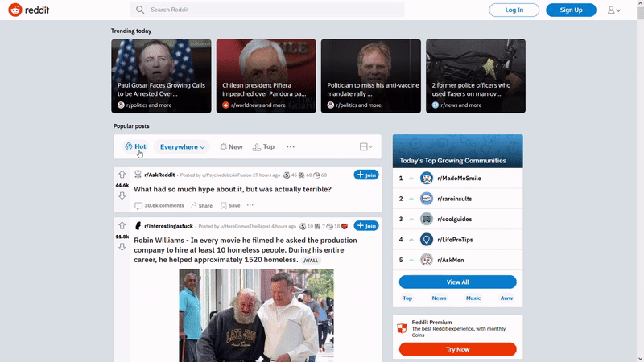

# Reddit Clone

<!-- TABLE OF CONTENTS -->
  
<h2 style="display: inline-block">Table of Contents</h2>

  

  <ol>
    <li>
      <a href="#about-the-project">About The Project</a>
      <ul>
        <li><a href="#built-with">Built With</a></li>
      </ul>
    </li>
    <li><a href="#demo--screenshots">Demo & Screenshots</a></li>
    <li><a href="#current-issues">Current Issues</a></li>
    <li><a href="#contributing">Contributing</a></li>
    <li><a href="#license">License</a></li>
  </ol>

 

# Live version [here](https://amy-reddit.netlify.app/).
 

<!-- ABOUT THE PROJECT -->
## About The Project

This is a frontend clone of [Reddit](https://www.reddit.com/), using the [Reddit API](https://www.reddit.com/dev/api/) to display posts and comments as on reddit.com. This version allows searching by hot, new, top and rising (and sub-searching by top of today, this week, this month, this year and all time). This SPA has 3 'pages' - the homepage, a page for each subtopic (subreddit) and a page for each post. Click on any link beginning with "r/" to visit a subreddit homepage, and click on the content of any post, its title or comment button to visit the post in detail including all comments.

### Built With

* React
* CSS
* [Markedjs](https://github.com/markedjs/marked)
 

## Demo & Screenshots
Some videos in case there are any changes to the Reddit API that result in the live site not functioning correctly:  

  
     
  
     
  

  

## Next Steps
* Use the before/after API endpoints to alert users of new posts, and to load posts when the user scrolls towards the bottom of the page
* Add default trending posts/subreddits to the navbar that display automatically if there are no subreddits that match the current search, or while the searchbar is empty 
* Create the homepage for each user, pulling in their post data and comment history

## Current Issues
* The fetch requests for each page sometimes take a few seconds to load all the data, so all the data doesn't always display at the same time
* Due to CORS issues with the Reddit API, the site doesn't display correctly on Firefox, though works fine on Firefox Developer Edition.
 

## Contributing

If you find a bug, please open an issue [here](https://github.com/AmyMaule/reddit/issues/new), including as much information as you can. 
You can request new features or modify current features [here](https://github.com/AmyMaule/reddit/issues/new) - please include search queries and expected results.
 

## License
MIT © [Amy Maule](https://github.com/AmyMaule)
